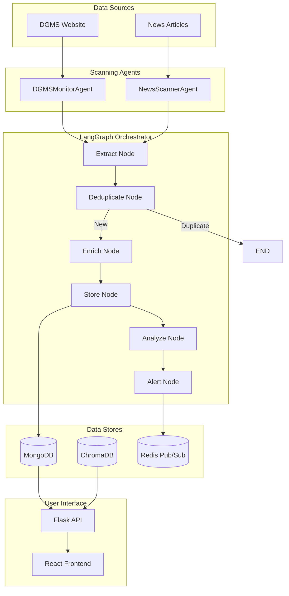

# 🛡️ MineGuard AI: Event-Driven Multi-Agent System for Proactive Mine Safety Analysis

> **An intelligent, autonomous system that transforms unstructured mine safety reports into actionable insights — enabling proactive monitoring, analysis, and prevention of mine accidents in India.**

[](https://www.python.org/)
[](https://langchain.com/langgraph)
[](https://maartengr.github.io/BERTopic/)
[](https://www.mongodb.com/)

---

## 🎥 Demo

https://github.com/user-attachments/assets/a9042710-895c-4cb3-8a0e-6bf1fc35e954

---

## 📋 Table of Contents

- [Overview](#-overview)
- [Architecture](#-system-architecture)
- [Technical Deep Dive](#-technical-deep-dive)
- [Tech Stack](#-tech-stack)
- [Setup & Installation](#-setup--installation)
- [API Reference](#-api-reference)
- [Configuration](#-configuration)

---

## 🧭 Overview

**MineGuard AI** automates the entire mine safety intelligence pipeline — from **data collection and structuring** to **semantic enrichment, analysis, and alert generation**.

### Key Capabilities

| Capability | Description |
|------------|-------------|
| **Data Ingestion** | Scrapes DGMS and news reports with OCR fallback for scanned PDFs |
| **Intelligent Structuring** | Converts unstructured text/PDFs into structured JSON using LLM extraction |
| **NL2MongoDB Query Translation** | Converts natural language questions into MongoDB queries |
| **Advanced Topic Modeling** | Uses BERTopic (SentenceTransformers + UMAP + HDBSCAN) for pattern discovery |
| **LLM-Powered Semantic Labeling** | Automatically generates professional labels for discovered incident clusters |
| **Event-Driven Pipeline** | LangGraph orchestrates the incident lifecycle with conditional routing |

---

## 🧠 System Architecture

MineGuard AI follows an **event-driven multi-agent architecture** powered by **LangGraph**, where specialized agents communicate asynchronously through a **Message Bus**.



### LangGraph Pipeline Nodes

| Node | Tool | Description |
|------|------|-------------|
| `extract` | `ExtractorTool` | Uses LLM to extract structured incident data from raw text |
| `deduplicate` | `DeduplicatorTool` | Queries MongoDB to check for existing similar incidents |
| `enrich` | `EnricherTool` | Adds cause codes and location data via heuristics + web search |
| `store` | `StorageTool` | Persists enriched incident to MongoDB |
| `analyze` | `AnalyzerTool` | Runs BERTopic clustering on all incidents |
| `alert` | `AlerterTool` | Generates safety alerts from analysis report |

### Multi-Agent Event Communication

All agents are connected via a **Message Bus** with event-driven pub/sub:

```
┌──────────────────────────────────────────────────────────────────────┐
│                           MESSAGE BUS                                │
├──────────────────────────────────────────────────────────────────────┤
│  DGMSMonitor ──new_dgms_report──► LangGraph ◄──new_news_article── NewsScanner
│       │                          Orchestrator                           │
│       │                              │                                  │
│       │         ┌────────────────────┴────────────────────┐             │
│       │         │  EVENTS: incident_stored, safety_alert, │             │
│       │         │  pipeline_complete, request_verification│             │
│       │         └────────────────────┬────────────────────┘             │
│       │                              ▼                                  │
│       │                    ConversationalAgent ──► Frontend             │
│       │                      (via Redis pub/sub)                        │
│       ◄──news_verification_results───────────────────────────────────────┘
└──────────────────────────────────────────────────────────────────────┘
```

| Event | Publisher | Subscribers |
|-------|-----------|-------------|
| `new_dgms_report` | DGMSMonitorAgent | IncidentAnalysisAgent |
| `new_news_article` | NewsScannerAgent | IncidentAnalysisAgent |
| `incident_stored` | Orchestrator | IncidentAnalysisAgent, DGMSMonitorAgent, ConversationalAgent |
| `safety_alert` | Orchestrator | IncidentAnalysisAgent, ConversationalAgent |
| `request_news_verification` | Orchestrator | NewsScannerAgent |
| `news_verification_results` | NewsScannerAgent | DGMSMonitorAgent, ConversationalAgent |
| `pipeline_complete` | Orchestrator | IncidentAnalysisAgent, ConversationalAgent |

---

## ⚡ Technical Deep Dive

### 1. LangGraph Event-Driven Orchestration

The system uses **LangGraph's StateGraph** to manage the incident processing lifecycle:

```python
# utility/langgraph_orchestrator.py
class IncidentState(TypedDict):
    raw_data: Dict[str, Any]
    source: str  # 'dgms' or 'news'
    extracted_incident: Optional[Dict[str, Any]]
    is_duplicate: bool
    enriched_data: Optional[Dict[str, Any]]
    analysis_results: Optional[str]
    alerts: List[str]
    errors: List[str]
```

**Conditional Routing:** The pipeline automatically stops if a duplicate is detected:
```python
self.builder.add_conditional_edges(
    "deduplicate",
    self.should_continue,
    {"continue": "enrich", "stop": END}
)
```

---

### 2. NL2MongoDB Query Translation

Natural language queries are converted to MongoDB queries using an LLM:

```python
# Example translations:
"accidents in Jharkhand in 2024"
→ {"find": {"mine_details.state": {"$regex": "jharkhand", "$options": "i"}, 
            "accident_date": {"$gte": "2024-01-01"}}}

"top 5 causes of fatalities"
→ {"aggregate": [{"$group": {"_id": "$incident_details.brief_cause", "count": {"$sum": 1}}},
                 {"$sort": {"count": -1}}, {"$limit": 5}]}
```

**Implementation:** `utility/tools/query_translator.py`

---

### 3. BERTopic Advanced Topic Modeling

The analysis module uses **BERTopic** for unsupervised discovery of incident patterns:

```python
# utility/analysis.py
from bertopic import BERTopic
from bertopic.representation import KeyBERTInspired, MaximalMarginalRelevance

topic_model = BERTopic(
    embedding_model="all-MiniLM-L6-v2",
    representation_model={
        "KeyBERT": KeyBERTInspired(),
        "MMR": MaximalMarginalRelevance(diversity=0.3),
    },
    min_topic_size=min(5, max(2, total // 10)),
)
topics, probs = topic_model.fit_transform(texts)
```

**LLM Semantic Labeling:** Topics are automatically labeled by an LLM:
```
Topic 0: "Underground Roof Collapse Hazards"
Topic 1: "Haul Road Transportation Accidents"
Topic 2: "Electrocution in Open-Cast Mines"
```

---

### 4. OCR Fallback for Scanned PDFs

When PDFs contain no selectable text (scanned documents), **PyTesseract** is used:

```python
# utility/extract.py
from pdf2image import convert_from_bytes
import pytesseract

if len(text) < 200:  # Likely a scanned PDF
    images = convert_from_bytes(data)
    ocr_texts = [pytesseract.image_to_string(img) for img in images]
    return "[OCR Extracted Text]\n" + "\n".join(ocr_texts)
```

**System Requirements:** `tesseract-ocr`, `poppler-utils`

---

### 5. Structured JSON Logging

All components use centralized JSON logging for observability:

```python
# utility/logger.py
{"timestamp": "2024-12-19T10:00:00Z", "level": "INFO", 
 "name": "langgraph.orchestrator", "message": "Node: extract", 
 "extra": {"source": "news"}}
```

---

### 6. Retrieval-Augmented Generation (RAG)

The chatbot combines multiple context sources:

| Source | Description |
|--------|-------------|
| **ChromaDB** | Historical PDF reports (embeddings) |
| **MongoDB** | Real-time structured incident data |
| **NL2MongoDB** | Dynamically generated queries for precise retrieval |

```python
combined_context = (
    f"--- PDF Context (Historical) ---\n{chroma_context}\n\n"
    f"--- Real-time Data (Live) ---\n{mongo_context}"
)
```

---

## 🧰 Tech Stack

| Layer | Technologies |
|-------|-------------|
| **Backend** | Python 3.12, Flask, asyncio |
| **AI/ML** | LangChain, LangGraph, GROQ (Llama), Google Generative AI |
| **Topic Modeling** | BERTopic, SentenceTransformers, HDBSCAN, UMAP |
| **OCR** | PyTesseract, pdf2image, Poppler |
| **Databases** | MongoDB (incidents), ChromaDB (vectors), Redis (pub/sub) |
| **Frontend** | React, Vite, TailwindCSS |

---

## 🚀 Setup & Installation

### Prerequisites

| Dependency | Version | Purpose |
|------------|---------|---------|
| Python | 3.12+ | Runtime |
| Node.js | 18+ | Frontend |
| MongoDB | 6.0+ | Incident storage |
| Redis | 7.0+ | Message queue |
| Tesseract | 5.0+ | OCR (optional) |
| Poppler | - | PDF to image conversion |

### Environment Variables

```bash
# Required
GROQ_API_KEY=your_groq_api_key          # LLM (Llama via GROQ)
GOOGLE_API_KEY=your_google_api_key      # Embeddings (Google Generative AI)
MONGODB_URI=mongodb://localhost:27017   # MongoDB connection

# Optional
TAVILY_API_KEY=your_tavily_key          # Web search for enrichment
REDIS_URL=redis://localhost:6379        # Redis connection
```

### 🐳 Docker (Recommended)

```bash
git clone https://github.com/23Tarandeep57/Mine-Safety-Analysis.git
cd Mine-Safety-Analysis
cp .env.example .env
# Edit .env with your API keys
docker-compose up --build
```

| Service | Port | Description |
|---------|------|-------------|
| `frontend` | 5173 | React web interface |
| `flask` | 5001 | REST API server |
| `agent` | - | LangGraph multi-agent worker |
| `redis` | 6379 | Message queue & pub/sub |
| `mongo` | 27017 | Incident database |

### 🔧 Manual Setup

```bash
# 1. Clone and setup
git clone https://github.com/23Tarandeep57/Mine-Safety-Analysis.git
cd Mine-Safety-Analysis
python3.12 -m venv venv
source venv/bin/activate
pip install -r requirements.txt

# 2. Install OCR dependencies (Linux)
sudo apt install tesseract-ocr poppler-utils

# 3. Start dependencies
docker-compose up -d redis mongo

# 4. Run services (3 terminals)
python app.py       # Terminal 1: Flask API
python agent.py     # Terminal 2: LangGraph Agent
cd Front-end/MSA && npm install && npm run dev  # Terminal 3: Frontend
```

---

## 📡 API Reference

### Chat Endpoint

```http
POST /api/chat
Content-Type: application/json

{"query": "What are the top causes of accidents in Jharkhand?"}
```

**Response:** Server-Sent Events (SSE) stream with real-time tokens.

### Health Check

```http
GET /api/health
```

---

## ⚙️ Configuration

### Key Configuration Files

| File | Purpose |
|------|---------|
| `utility/config.py` | Environment variables and defaults |
| `docker-compose.yml` | Docker service definitions |
| `.env` | API keys and secrets |
| `schema.md` | MongoDB document schema |

### MongoDB Schema

```json
{
  "accident_date": "2024-07-23",
  "mine_details": {
    "name": "Gevra Opencast Mine",
    "state": "Chhattisgarh",
    "district": "Korba",
    "mineral": "Coal"
  },
  "incident_details": {
    "brief_cause": "Worker hit by dumper on haul road",
    "cause_code": "3.2 - Dumper",
    "fatalities": [{"name": "...", "age": 25}]
  },
  "verification": {
    "status": "verified",
    "articles": ["https://..."]
  }
}
```

---

## 📁 Project Structure

```
Mine-Safety-Analysis/
├── agents/                      # Agent implementations
│   ├── incident_analysis_agent.py  # LangGraph orchestrator consumer
│   ├── news_scanner_agent.py       # News scraping
│   └── dgms_monitor_agent.py       # DGMS scraping
├── utility/
│   ├── langgraph_orchestrator.py   # LangGraph StateGraph pipeline
│   ├── analysis.py                 # BERTopic clustering
│   ├── chatbot_utils.py            # RAG retrieval logic
│   ├── logger.py                   # JSON structured logging
│   └── tools/                      # Modular tool implementations
│       ├── base.py                 # Tool base class
│       ├── extractor.py            # LLM extraction
│       ├── deduplicator.py         # MongoDB duplicate check
│       ├── enricher.py             # Location/cause enrichment
│       ├── storage.py              # MongoDB persistence
│       ├── analyzer.py             # BERTopic analysis
│       ├── alerter.py              # LLM alert generation
│       └── query_translator.py     # NL2MongoDB
├── app.py                       # Flask API server
├── agent.py                     # Multi-agent entrypoint
├── Front-end/MSA/               # React frontend
└── docker-compose.yml           # Docker orchestration
```

---

## 📄 License

MIT License - See [LICENSE](LICENSE) for details.

---

## 🙏 Acknowledgments

- **DGMS India** for public mine safety data
- **LangChain** for the agent framework
- **BERTopic** for topic modeling
- **GROQ** for fast LLM inference
